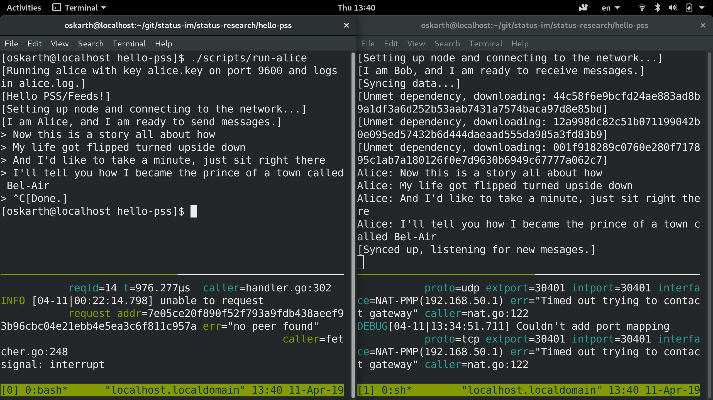

# MOVED REPOSITORY TO (status-im/staples)[https://github.com/status-im/staples].

---

# Hello Staples

*Staples was made during Status #buidleweek.*


*Replicated chunks made out of robust zinc-stained steel in an ordered log.*

For messaging, we need to store and pass things around between people. Swarm is a place to store and spread thing. PSS is a way to do messaging on top of Swarm. Sometimes people are away, and when they come back they need a way to find out what they missed. Feeds is a place we can look to find thing that have changed. Staples is a proof of concept for messaging using Swarm, PSS and Feeds.

## What it looks like



You can see a demo of it [here](https://www.youtube.com/watch?v=HwiR0_KCQuI).

## Instructions

```
# Install Swarm locally:
# https://swarm-guide.readthedocs.io/en/latest/installation.html

# In three separate terminals, run the following:
./scripts/run-alice
./scripts/run-bob
./scripts/run-charlie

# Send mesages from Alice and notice how it appears in Bob's window.
# If Bob disconnects and then reconnects, it fetches messages it missed since last time.
```

## Rationale

**Context**: Status currently uses Whisper as a messaging protocol. For offline inboxing, and it uses Whisper mailservers in a cluster for offline inboxing. To get the latest messages, it currently assumes a given mailserver has received all latest messages and queries it upon startup. To do message ordering, it uses Lamport timestamps with real-time clock for hints., but largely relies on Whisper mailservers being highly available to provide this consistency.

1. **PSS** is in some ways the spiritual successor to Whisper, and it has a very similar API. It provides better scalability due to its superior routing strategy, while maintaining the ability to be privacy-preserving. The proof of work used in Whisper is also a poor fit for heterogenerous devices. While Swap incentives, the DoS protection mechanism in PSS, isn't implemented yet, it is arguably a more sound design. Whisper is also not actively developed, and several developers have moved on to working on Swarm/PSS. For a more detailed comparison, see [here](https://our.status.im/whisper-pss-comparison/).

2. **Swarm** is a distributed storage platform and content distribution network, which deals with things such as replication and fault tolerance in a rigorous way. This is unlike Whisper mailservers, which have high uptime requirements, and fails to enable reliable offline inboxing during events such as [Chaos Unicorn Day](https://chaos-unicorn-day.org/). In Swarm content is spread out and replication across the network, it doesn't require high uptime for any individual node. Research and prototyping of things such as SWAP accounting system, light nodes, erasure coding, proof of custody and storage insurance is also at an avanced stage. To read more about Swarm and how it works, see the documentation for [Swarm POC3](https://swarm-guide.readthedocs.io/en/latest/).

3. **Feeds** provide a way to get mutable state in an immutable world. Since Feeds use Swarm, fault tolerance and availability is baked in. Conceptually, it is similar to ENS or DNS. For more on Feeds, see [here](https://swarm-guide.readthedocs.io/en/latest/usage.html#feeds).

4. **Message dependencies**. By including hashes of previous message dependencies, we can build up a Distributed Acylic Graph (DAG) of messages. Messages that haven't had its dependencies met are not delivered to the upper layer. This ensures high availaility while maintaining casual consistency (topologically ordered conversations). For more on rationale of this, see this post on [Discuss](https://discuss.status.im/t/introducing-a-data-sync-layer/864) and this [data sync research thread](https://discuss.status.im/t/mostly-data-sync-research-log/1100/15).

## How it works

- Alice, Bob and Charlie are three local Swarm nodes. It uses the Go API (RPC and HTTP client).
- A message consists of some text and parent message ids.
- Alice sends messages to Bob via PSS, including parent messages hashes (if they exist). 
- When Alice sends a message, it also updates its feed with topic `bob` (and uploads chunk to Swarm).
- When Bob comes online, it first checks Alice's feed under topic `bob`.
- Alice does not have to be online for Bob to receive messages from her.
- If Bob sees a parent message it hasn't seen before, it first fetches that chunk on Swarm.
- Bob only sees the message once all messages dependencies have been delivered.
- When Bob has synced up to the present state, it also receives live messages via PSS.
- Charlie is a helper node to deal with some Kademlia/local network connectivity issues.

## Shortcomings & Enhancements

Things that can be improved:

- Only supports Alice talking to Bob right now.
   - => Should be fairly straightforward to generalize this for 1:1 chat at least
- Mapping of concepts to group chat and public chat not obvious.
   - => Different structure with a local log that requires different patterns, but it's doable.
- Only CLI interface.
   - Integrate as API console-client, or make UI, or add to Status app.
- Bad code with hardcoded endpoints, poor structure, exposed private keys, etc.
   - => Refactor and use best practices; integrate into existing code bases.
- Due to issue with stale/non-existant Feed reads, cheats a bit using local helper node.
   - likely cause: local network connectivity issues or poor Kademlia connectivity
   - => Kademlia connectivty can be checked by using health checks
   - => local network connectivity just requires a bit more debugging/log checking
- Lack of Swarm light client mode for mobile.
   - This is under active development
   - => Just try running it and see what happens, desktop should be fine, can fork with hacks
- Swarm is still under active development.
   - This means things like incentives, fault tolerance, connectivity etc are still issues
   - => Don't make strong assumptions but use it optimistically
   - => Try it and file issues / help fix them
- Not integrated with current Status code bases (status-go/console-client) and protocol.
   - Additionally, some small differences when it comes to what keys/identities etc are.
   - => Do it, fairly straightforward code-wise for basic infrastructure
   - => Write up upgrade path for Whisper->PSS and how to use e.g. feeds in parallel
   - => For protocol, write proposal to specs repo on what upgrade would look like
   - => Consider parallel support via feature flag for gradual move
   - => More research/thinking on properties and trade-offs
- Probably more.

## Takeaways

- It was easier than expected to get a basic PoC up and running, and swarm is really cool and underutilized
- That said, there are a bunch of rough edges (API docs, connectivity) and missing features
- We should spend more time seriously trying it out (both in terms of building light client, and using pss/feeds for app and in protocol work).