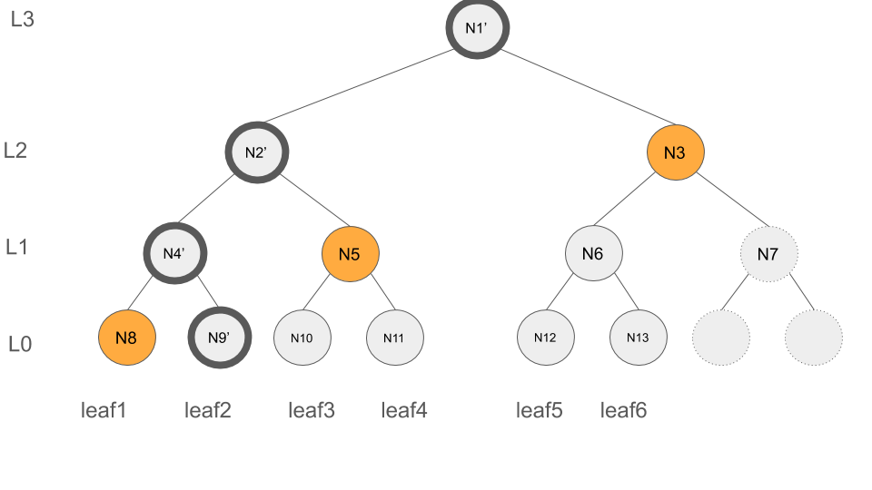

# Solution Overview
> In a Merkle Tree with the capacity of `n` leaves , one can compute the root of the tree by maintaining the root nodes of log(n) number of complete Merkle trees. 

We use the preciding  observation and define `F = [(L0,H0,index0), ..., (Ld,Hd,indexd)]` to be an array of size log(n)+1 holding the root of the complete Merkle trees (all positioned on the left side of the tree) for levels `[0, d=log(n)+1]`. Each entry of `F`  holds a tuple `(L,index, H)` `H`is the root of the complete subtree at level `L`, and  `index` indicates the index of the leaf node whose insertion resulted in `H`.

For the Merkle Tree shown in Figure below, `F = [(L0, N12, leaf5), (L1, N6, leaf6), (L2, N2, leaf4), (L3, N1, leaf6)]` is highlighted in green. Note that none of the gray nodes are stored as part of `F`.


## Computing the root after deletion

Consider the deletion of the `leafi` with the authentication path / (membership proof) of the follwoing form `authpath = [(L0,H0), ..., (Ld,Hd)]` where `H` values represent the value of the merkle tree nodes at the indicated level `L`. 
The authentication path of `leaf2`  is illustrated in the following figure and consists of `authpath2 = [(L0, N8), (L1,N5), (L2,N3), (L3,N1)]`.


We need to update `F` based on `authpath2`. In specific, we need to determine whether any of the nodes whose values get altered as the result of deletion of a leaf node intersect with the nodes in `F`, and if this is the case the corresponding nodes in `F` shall get updated too.

Lets clarify it by the help of an example. Consider `leaf2`, the deletion of `leaf2` impacts `N9, N4, N2` and `N1`(root) of the tree. 


Thus, in order to update `F`, we need to update those entries that contain `N9, N4, N2` or `N1`. 
- inputs: 
  - `authpath2 = [(L0, N8), (L1,N5), (L2,N3), (L3,N1)]`
  - `F = [(L0, N12, leaf5), (L1, N6, leaf6), (L2, N2, leaf4), (L3, N1, leaf6)]` 
- Update procedure: 
  - `N9` at level `L0`, HasCommAnc(leaf2,leaf5) = no, thus `F` does not change
  - `N4'` at level `L1`, HasCommAnc(leaf2,leaf5) = no, thus `F` does not change
  - `N2'` at level `L2`, HasCommAnc(leaf2,leaf4) = yes, thus `F = [(L0, N12, leaf5), (L1, N6, leaf6), (L2, N2', leaf4), (L3, N1, leaf6)]` 
  - `N1` at level `L3`, HasCommAnc(leaf2,leaf6) = yes, thus `F = [(L0, N12, leaf5), (L1, N6, leaf6), (L2, N2', leaf4), (L3, N1', leaf6)]` 
- Output
  - `F' = [(L0, N12, leaf5), (L1, N6, leaf6), (L2, N2', leaf4), (L3, N1', leaf6)]` 


### Common Ancestor
In order to determine whether two nodes with indices `i` and `j` have common anscestor at a particular level `lev`, the followong formula can be applied

check whether `floor( (i-1)/2^lev )` is equal to `floor( (j-1)/2^lev )`


# Update algorithm
- Inputs: 
  - `F = [(H0,index0), ..., (Hd,indexd)]`
  - `leafIndex` ( The index of the deleted leaf)
  -  `authpath = [H0, ..., Hd]` (The authentication path of the deleted leaf)
  -  `Z = [H(0), H(Z[0]||Z[0]), H(Z[1]||Z[1]), ..., H(Z[d-1]||Z[d-1])]`
- Output: `F'`
  
```
path = binary representation of leafIndex - 1
acc = Z[0]
for lev in 0..d # d inclusive
  if HasCommAnc(leafIndex, F[lev].index,lev) == true # F[lev].index has common ancestor with leafIndex at level lev 
    F[l] = acc
  if the last bit of path is 1
    acc = H(authPath[lev], acc)
  else
    acc = H(acc, authPath[lev])
  shift path right by 1
```
```
HasCommAnc(i, j, lev) =
  return floor( (i-1)/2^lev ) == floor( (j-1)/2^lev )
```
